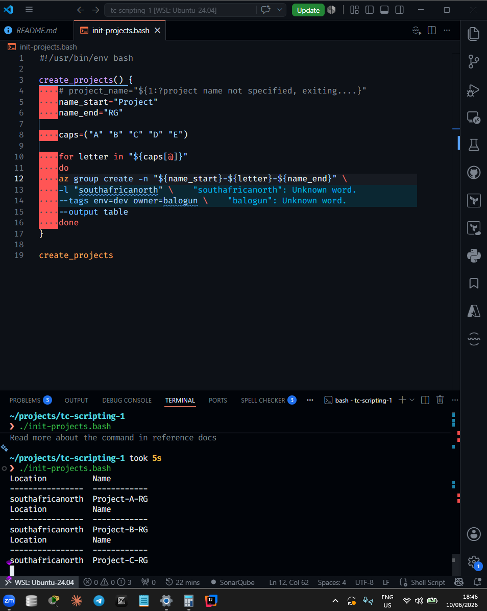
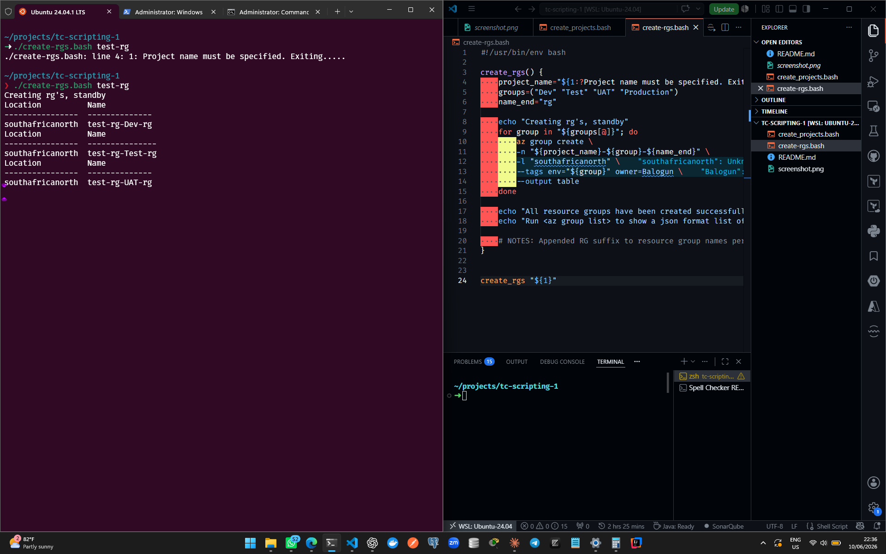
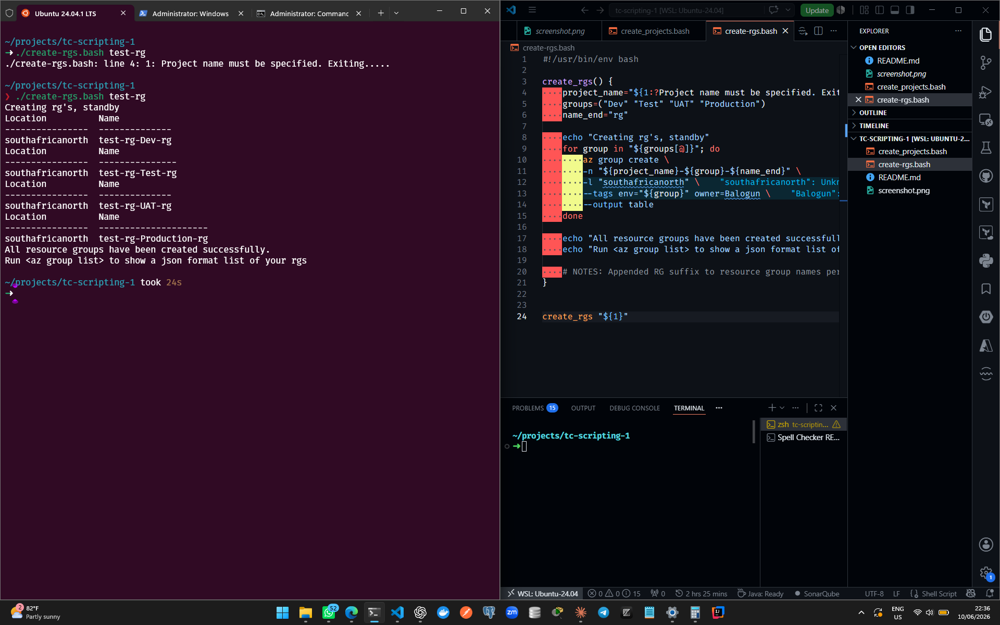
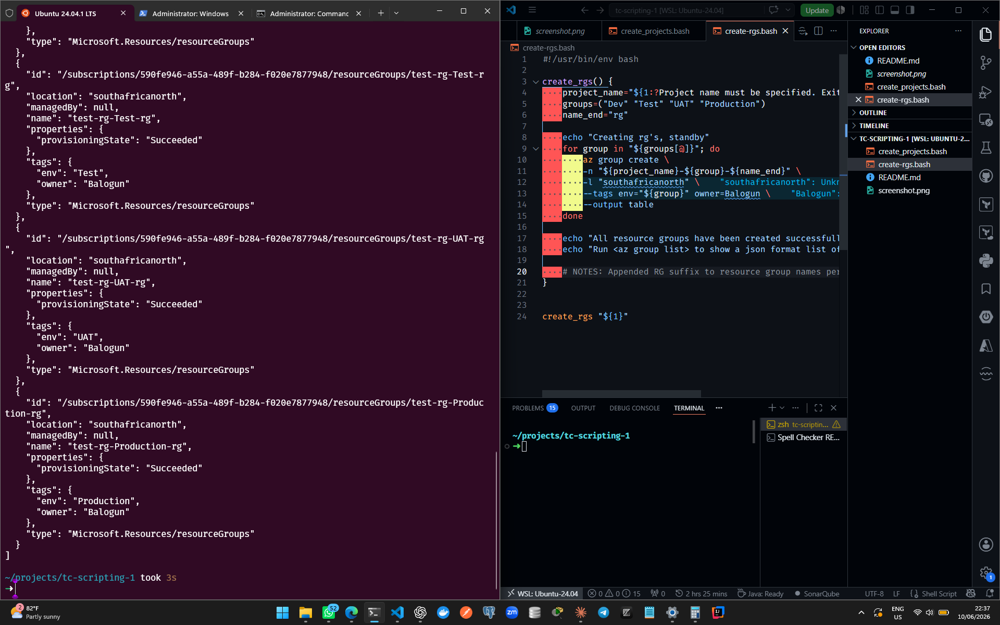

## Techcrush scripting assignment 2

**Student name: Teslim Balogun**
**Student ID: CLC/2026/TC-7/016**

### Task 1

A company creates the same resource groups every week for different projects.

**Current process:**

An administrator manually creates:

- Project-A-RG
- Project-B-RG
- Project-C-RG
- Project-D-RG
- Project-E-RG

…every week.

Management says: *“This process is wasting time. Automate it.”*

#### Solution

`init-projects-1.bash` contains the automation script for this task. The screenshot below shows the script execution:

---



### Task 2

Create a Bash script that:

- Accepts a project name
- Automatically creates resource groups for:
  - Dev
  - Test
  - UAT
  - Production

#### Solution





---

### What I Learned

Azure resource groups follow a naming convention like:
<project>-<app>-<env>-rg

Concrete examples:

- `payment-api-test-rg`
- `blog-prod-rg`
- `auth-service-staging-rg`

Advanced naming schemes look like:
<org>-<app>-<env>-<region>-<type>

Where:

- `org` = company name
- `app` = service/application name
- `env` = environment
- `region` = Azure region
- `type` = resource type

e.g. `acme-payments-prod-southafricanorth-rg`

#### Best Practices

**Use lowercase only:** Azure supports uppercase, but it's recommended to prefer lowercase when naming resources and resource groups, with dashes (`-`) as separators.
✔ payment-api-prod-rg
❌ Payment-API-Prod-RG
✔ payment-api-prod-vm
❌ payment-api-prod-storage

**Always include the environment in the resource/group name:** Omitting the environment name can lead to confusion in production, where there could be many resources and groups each belonging to different environments.
✔ payment-api-dev-rg
✔ payment-api-staging-rg
✔ payment-api-prod-rg
❌ payment-api-rg

For starters, stick with this format for naming groups/resources: `<app>-<env>-rg`

**Prefer full flag names over shorthands:** e.g. prefer `--name` instead of `-n`, or `--location` instead of `-l`. It is fine to use shorthands for small, non-production scripts (as is the case in my assignment solution).

**Separate multiple flags onto their own lines:** This improves readability of long commands in a script. For example:

```bash
az group create -n "${name_start}-${letter}-${name_end}" \
    -l "southafricanorth" \
    --tags env=dev owner=balogun \
    --output table
```

reads much better than:

```bash
az group create -n "${name_start}-${letter}-${name_end}" -l "southafricanorth" --tags env=dev owner=balogun --output table
```